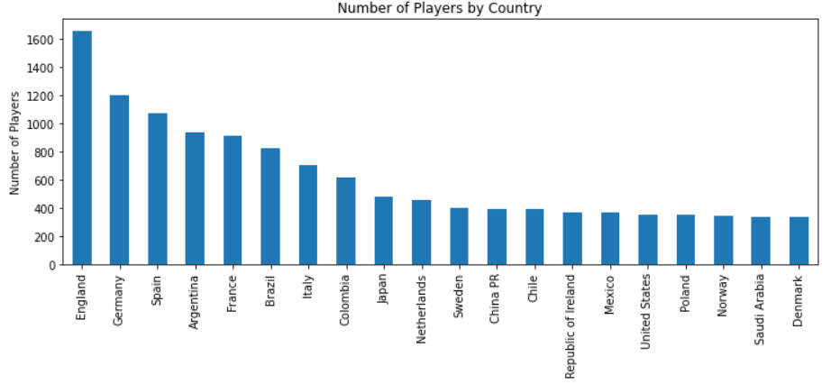

# Various Player Predictions Using FIFA 19 Game Data

## Introduction

For this project, our team has chosen to focus on using FIFA video game player data to make various predictions such as what position they are most likely to play, what a players salary is, what their in game rating is, and what country they are from. All of these predictions are made using the in-game stats such as what their dribbling, shooting, or defending levels are, what their position chemistry would be, and many other factors. Different machine learning methods are used such as clustering, (**insert whatever other things we use here**). We will begin by going over how we had to clean our data to make it usable. Following that, each feature we will be predicting will receive its own section going over the methods and algorithms used for predictions and a conclusion. Finally, an overall closing conclusion will be made on the effectiveness of these features we used in relation to making predictions.

## Motivation

FIFA video games contain a plethora of data within them not just about the matches being played and the users playing the game, but on each and every soccer player at the professional level. All of this data fascinated us, and there were so many possibilities with it. Of course, video game data does not match up well with real life scenarios, but perhaps there is a way to make some sort of close predictions using the numbers that Electronic Arts (the game developer) have manufactured for the game. Will these numbers relating to skill and chemistry hold any weight when it comes to making predictions, or are they totally arbitrary and only useful for balancing gameplay? As sports and video game lovers, we knew we had to find this out as it was something we found exciting and needed to know the answer to.

## Dataset

Our data came from [Kaggle](https://www.kaggle.com/karangadiya/fifa19) which we found while browsing cool and intersting data we could work with. We chose this set because there were many features for us to use and most of it was already in a nice to use numerical form.

### Cleaning Data

In order to get our data into a usable form, we had to do a few things including removing replacing some NaN values with zeroes, removing the other NaN filled rows, and converting strings that were meant to be used as numbers into usable integers or floats.

Initially, the goal was to get rid of any players who have NaN values populating a majority of their columns as they won't be of much use to us when making predictions. An issue with that is that if a player is a goalkeeper (GK), then every single column with a position chemistry was NaN. It didn't seem right to just throw out the goalkeepers, so we began by replacing those specific NaN values with 0 to indicate they had no chemistry in other positions. To do that, we only dropped rows that had NaN in two of the columns, Club and Position. When we did this, we were left with only NaN values relating to goalkeeper missing values.

```
clean_fifa_df = clean_fifa_df.dropna(subset=['Club', 'Position'])
```

Once the bad rows were taken out, we had to replace all of the NaN values with 0 which was a simple fix. We reached a new issue when looking at the values populating those position columns. Each one has a number, but it is paired with a '+' and another value. To keep things simple, we kept only the base value that appears before the plus sign. Once this was accomplished, we could then convert the columns to an 'int' datatype.

```
positions = ['LS', 'ST', 'RS', 'LW', 'LF', 'CF', 'RF', 'RW', 'LAM', 'CAM', 'RAM', 'LM', 'LCM', 'CM', 'RCM', 'RM', 'LWB', 'LDM', 'CDM', 'RDM', 'RWB', 'LB', 'LCB', 'CB', 'RCB', 'RB']
for pos in positions:
  clean_fifa_df[pos] = clean_fifa_df[pos].str.split('+').str[0]
  clean_fifa_df[pos] = clean_fifa_df[pos].astype(int)
clean_fifa_df.head()
```
Now there were no NaN values and the positions were all integers, but there were other columns such as height, weight, value, and wages that were all in string format when they needed to be something numeric. This required the removal of the euro symbol for any monetary columns, removing any letters, converting height to inches, and correctly parsing wages and value into numbers based on whether it was in thousands (K) or millions (M).

```
# This parses the height into inches
def parse_ht(ht):
    ht_ = ht.split("'")
    ft_ = float(ht_[0])
    in_ = float(ht_[1].replace("\"",""))
    return (12*ft_) + in_

clean_fifa_df['Height'] = clean_fifa_df['Height'].apply(lambda x:parse_ht(x))
clean_fifa_df['Weight'] = clean_fifa_df['Weight'].str.split('l').str[0]

# Removing the euro symbol
clean_fifa_df['Value'] = clean_fifa_df['Value'].str.replace('€', '')
clean_fifa_df['Wage'] = clean_fifa_df['Wage'].str.replace('€', '')

# Turning value and wages into usable numbers
clean_fifa_df['Value'] = (clean_fifa_df['Value'].replace(r'[KM]+$', '', regex=True).astype(float) * clean_fifa_df['Value'].str.extract(r'[\d\.]+([KM]+)', expand=False).fillna(1).replace(['K','M'], [10**3, 10**6]).astype(int))
clean_fifa_df['Wage'] = (clean_fifa_df['Wage'].replace(r'[KM]+$', '', regex=True).astype(float) * clean_fifa_df['Wage'].str.extract(r'[\d\.]+([KM]+)', expand=False).fillna(1).replace(['K','M'], [10**3, 10**6]).astype(int))

# Turning everything into ints
clean_fifa_df['Value'] = clean_fifa_df['Value'].astype(int)
clean_fifa_df['Wage'] = clean_fifa_df['Wage'].astype(int)
clean_fifa_df['Weight'] = clean_fifa_df['Weight'].astype(int)
```

One final bit of cleaning was done by converting the club, nationality, position, and preferred foot columns to something along the lines of one hot encoding. Each unique value corresponded with a numerical value and the string was replaced with this number. This way, we could still include the string based columns when making our predictions since they are very likely to make a difference.

```
# 27 different positions seen with y.unique(). Also need to make things numeric for the clustering
y = fifa_df['Position']

class_mapping = {label:idx for idx,label in
                 enumerate(np.unique(y))}
fifa_df['Position'] = fifa_df['Position'].map(class_mapping)

y = fifa_df['Position']

X = fifa_df.drop(['Position'], axis=1)

class_mapping = {label:idx for idx,label in
                 enumerate(np.unique(X['Nationality']))}
X['Nationality'] = X['Nationality'].map(class_mapping)

class_mapping = {label:idx for idx,label in
                 enumerate(np.unique(X['Club']))}
X['Club'] = X['Club'].map(class_mapping)

class_mapping = {label:idx for idx,label in
                 enumerate(np.unique(X['Preferred Foot']))}
X['Preferred Foot'] = X['Preferred Foot'].map(class_mapping)
```

### Exploring Data

Prior to totally removing any strings in the data, we explored it by looking at some fun graphs showing many of the max values relating to wages, values, and total player counts. Each graph shows the top 20 highest values.

First we checked out how many players there were in each country.



Second, we saw how the average wages looked for each club.


Last, we wanted to know which club had the highest average value of players.


Looking at this data shows that nationality and club play a big factor into someones success. If you play for Juventus, there's a much higher chance that your valuation is above the mean player in the game.

We also wanted to see if there were certain attributes where correlate to good players for a particular position.

We initially compared how physical attributes wages and overall varied related to each other and how this varied for each position tend to cluster in particular areas 


From this graph, we were able to notice certain patterns for example goalkeepers tend to be taller and usually  can play until much older than the rest of the player base

Second, we observed the skill attributes and their relationship with each position


We again see patterns forming, depending on the combination of attributes we see how the different positions tend to cluster to a particular sector of the graph as expected goalkeepers tend to be strong but have very bad ball control, strikers tend to have good ball control and longshots, by determining what characteristics are key for each position, it is possible to predict given a players stats where they should play, which, in reality, is not always where they are currently playing

Lastly, we wanted to explore how age influenced the value of a player regardless of their overall rating 


The older the player regardless of their current rating their value drops, this is likely because it's not expected for them to continue to perform at top condition for much longer, inversely we see that younger players tend to be paid less, this is likely since it is still not clear what their full potential or value is, we can also notice that the top valued players and who present the best overalls tend to be around 27 years old, this seems to be the age in which a soccer player achieves the peak of their career.

## Clustering

One of the ways we wanted to make predictions was by clustering the data in hopes of making the clusters based on what position the player plays. To do this, we had to use PCA in order to be able to make any graphs. Only 2 features were chosen in order to make a 2D graph.

Clustering can be done in with many different algorithms, and we thought comparing 3 different algorithms would shed a little light on how each works. We began with K-Means, then Spectral, and finally DBSCAN. We didn't expect clustering to do much considering we had to rely on only 2 features to make these clusters, and 2 features in this dataset holds very little information regarding what player you might be looking at. Also, another shortcoming is that you can't decide on what to make your clusters based on. I knew there were 27 positions, but making 27 clusters was difficult, so I decided on using 10 and hoping for the best so that things didn't become too cluttered. Regardless, clustering was something we wanted to visualize just to learn more about it.

### K-Means Clustering

We began with K-Means since that is the go-to cluster algorithm we have been taught many times and what data scientists seem to rely on often. Based on our graph below, you can see that 9 out of 10 of the clusters fell into one giant blob of mess. K-Means relies on creating central points, or centroids, that are surrounded by other points that the algorithm believes are in the same class. Because of the giant blob, most of the centroids are simply dispersed in the cloud of points. Interestingly enough, and what we were hoping for, is that there is one cluster separate from the blob. Based on how we had to clean the data and how the original data looked, this cluster must be the goalkeepers. They were the only rows of data to have no values for position chemistry, and I believe the algorithm saw that. For K-Means, we can't say much about the clusters since a majority are all together.


### Spectral Clustering

Spectral clustering was our second choice for what to experiment with as it is a close relative to K-Means. The same idea is present, but calculated in a different way. Instead of looking at how close the points are, spectral clustering looks at connections between the points as if they were linked nodes. This helps in situations where clusters aren't just points of high density, but dense areas in special shapes that don't fit the norm. In our case, the giant blob previously mentioned is still an issue, so spectral clustering didn't deviate too far from K-Means. One interesting thing we noticed is that there actually weren't even 10 clusters. If you look at the legend compared to the graph itself, some colors don't appear on the graph despite having a spot in the legend. Orange and purple disappear completely. We aren't sure exactly why this happened, but it is interesting that the algorithm itself decided that we didn't need 10 clusters. A final note is that it also decided that the goalkeepers are separate from the rest of the players. Our shortcomings stay the same that the blob made things very complicated.


### DBSCAN

Our final clustering algorithm was DBSCAN. DBSCAN is neat because it strays from the previous clustering algorithms. Instead of being told how many clusters we want to see, we rely on the algorithm to choose for us after we state the maximum distance between points for them to be considered in the same neighborhood which is called eps. For our graph to look different from the previous graphs, we changed the default eps value from .5 to .25. This change made a massive change in how the algorithm clustered, and the results were exciting. We finally split up the massive blob that looked so bad in the previous graphs. We now have 3 very distinct major cluster areas. I like to think of them as attacking positions, defending positions, and goalkeepers. The extra clusters within the attacking and defending blobs must have been more specific positions. Having 10 total clusters was a bit unnecessary but I believe that if we had a full 27, there would be some sort of distinction between them all. DBSCAN had the most promising results when it came to clustering.


## Wage Prediction

Next, we wanted to try and predict wages based on the features. The current data set has almost all numerical columns besides Nationality, Club, and Preferred Foot. We did value counts on Nationality and Club to see if we could come up with dummy columns, but the total number of unique values for both columns were 841. Adding 841 columns into our dataset was probably not a good idea.


### Additional Feature Engineering

Since creating 841 new columns was not feasible, we needed to come up with a way to transform the Nationality and Club columns. By doing a value_counts on Nationality, we were able to see the distribution of players by country. After combing through, we decided to classify nations as "major nations" if the nation exceeded 250. Next, we aggregated the clubs and their average salary in our exploratory data analysis. By taking a look at that graph, we noticed a significant jump between the top 20 clubs with the highest average salary. We decided to make the column a 1 if the are a top 20 paid club and a 0 if they are not. Finally, for the foot preference we choose 1 for right and 0 for left.

```
#Converting preferred foot to 0 = Right and 1 = Left
def foot_conversion(wg):
    if wg == 'Right':
      return 1
    else:
      return 0
#Converting the nationality column if they are a major nation
def major_nation(nt):
  if (nt in nat_list):
      return 1
  else:
      return 0

#Converting the clubs column if they are a major club
def top_20(clb):
  if (clb in top_20_clubs):
      return 1
  else:
      return 0


wage_df['Preferred Foot'] = wage_df['Preferred Foot'].apply(lambda x:foot_conversion(x))
wage_df['Nationality'] = wage_df['Nationality'].apply(lambda x:major_nation(x))
wage_df['Club'] = wage_df['Club'].apply(lambda x:top_20(x))
```

### Model Predictions

With the new dataset, we can start training models and see how they are performing. We first start off by splitting the dataset into train and test sets. Next, we started to feed the data into plain models with no hyperparameter tuning. The models we selected were Liner Regression, Decision Tree Regressor, Linear SVR, ADA Boost Regressor, Gradient Boosting Regressor, and Random Forest Regressor.

```
X = wage_df.copy()
X = X.drop(['Wage'],axis =1)
y = wage_df['Wage']

X_train, X_test, y_train, y_test = \
    train_test_split(X, y, test_size=0.2, random_state=42)
```

Example of one of the plain model code we used.

```
lr = LinearRegression()
lr.fit(X_train, y_train)
y_pred = lr.predict(X_test)
print('Test Accuracy: %.3f' % lr.score(X_test, y_test))
print("Mean Squared error : %s" % mean_squared_error(y_test, y_pred))
print("Mean Absolute error : %s" % mean_absolute_error(y_test, y_pred))
print("R2 Score: %s" % r2_score(y_test, y_pred))
```

Results by Model Accuracy from Largest to Smallest:
1. GradientBoostingRegressor    (0.873)
2. RandomForestRegressor        (0.861)
3. Linear LinearRegression      (0.823)
4. DecisionTree Regressor       (0.754)
5. Linear SVR                   (0.289)
6. ADABoostRegressor            (0.210)

### Hyper Parameter Tuning

With the results, we took the top two performing models (GradientBoosting and RandomForest) and hyperparameter tuned both models

```
rfr = RandomForestRegressor()
rfr_params = {'bootstrap': [True, False],
 'max_depth': [10, 20, 30, 40, 50, 60, 70, 80, 90, 100, None],
 'max_features': ['auto', 'sqrt'],
 'min_samples_leaf': [1, 2, 4],
 'min_samples_split': [2, 5, 10],
 'n_estimators': [200, 400, 600, 800, 1000, 1200, 1400, 1600, 1800, 2000]}
rsearch = RandomizedSearchCV(rfr, rfr_params, cv=5, n_iter=10, n_jobs=5, scoring='neg_mean_squared_error', verbose=True)
rsearch.fit(X_train, y_train)
```

After running grid searches for the best parameters and plugging them into the model. The models performed worse than the plain models. The best model we found was the plain GradientBoosting model.


You can use the [editor on GitHub](https://github.com/noahplacke/BDS_FIFA/edit/gh-pages/index.md) to maintain and preview the content for your website in Markdown files.

Whenever you commit to this repository, GitHub Pages will run [Jekyll](https://jekyllrb.com/) to rebuild the pages in your site, from the content in your Markdown files.

Markdown is a lightweight and easy-to-use syntax for styling your writing. It includes conventions for

```markdown
Syntax highlighted code block

# Header 1
## Header 2
### Header 3

- Bulleted
- List

1. Numbered
2. List

**Bold** and _Italic_ and `Code` text

[Link](url) and 
```

For more details see [GitHub Flavored Markdown](https://guides.github.com/features/mastering-markdown/).
